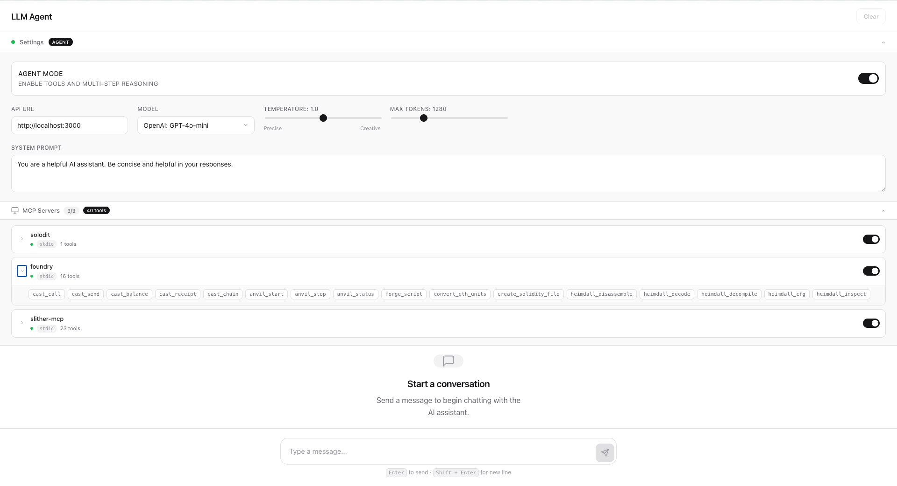

# LLM Agent Server

A learning project built to understand how LLM agents work and to gain deeper knowledge of Rust. This project implements an agent server that connects Large Language Models (LLMs) from OpenRouter with external tools through the Model Context Protocol (MCP).



### Project Structure

```
agent/
├── Cargo.toml
├── .env.example
├── mcp_config.json          # MCP server configuration
├── src/
│   ├── main.rs              # HTTP server entry point
│   ├── config.rs            # Configuration from environment variables
│   ├── models.rs            # Data models (requests/responses)
│   ├── openrouter.rs        # OpenRouter API client
│   ├── handlers.rs          # HTTP request handlers
│   ├── agent.rs             # Agent orchestration logic
│   ├── error.rs             # Error handling
│   └── mcp/                 # MCP protocol implementation
│       ├── manager.rs       # MCP server management
│       ├── connection.rs    # Transport layer (stdio/HTTP)
│       ├── protocol.rs      # MCP protocol definitions
│       └── types.rs         # MCP data types
└── frontend/                # React frontend
    └── src/
        ├── components/      # UI components
        ├── hooks/           # React hooks
        ├── api/             # API client
        └── styles/          # CSS styles
```

## Quick Start

### Prerequisites

- Rust (latest stable)
- Node.js 22+ (for frontend)
- OpenRouter API key ([get one here](https://openrouter.ai/))

### Backend Setup

1. Clone and navigate to the project:
```bash
cd agent
```

2. Copy environment template and add your API key:
```bash
cp .env.example .env
```

3. Run the server:
```bash
cargo run
```

The server will start on `http://localhost:3000`

### Frontend Setup

1. Navigate to frontend directory:
```bash
cd frontend
```

2. Install dependencies:
```bash
npm install
```

3. Start development server:
```bash
npm run dev
```

The frontend will be available at `http://localhost:5173`

## API Endpoints

| Method | Endpoint | Description |
|--------|----------|-------------|
| `GET` | `/health` | Health check with MCP server status |
| `POST` | `/v1/chat/completions` | OpenAI-compatible chat completion |
| `POST` | `/v1/chat/completions/stream` | Streaming chat completion (SSE) |
| `POST` | `/v1/agent/chat` | Simplified agent chat interface |
| `POST` | `/v1/agent/run` | Agent execution with tools |
| `GET` | `/v1/models` | List available models from OpenRouter |
| `GET` | `/v1/agent/tools` | List available MCP tools |
| `GET` | `/v1/mcp/servers` | List MCP servers and their status |
| `POST` | `/v1/mcp/servers/enable` | Enable an MCP server |
| `POST` | `/v1/mcp/servers/disable` | Disable an MCP server |

### Example Request

```bash
curl -X POST http://localhost:3000/v1/agent/chat \
  -H "Content-Type: application/json" \
  -d '{
    "message": "Hello, who are you?",
    "model": "openai/gpt-4o-mini"
  }'
```

### Popular MCP Servers

| Server | Description | Transport | Requires API Key |
|--------|-------------|-----------|------------------|
| `filesystem` | File system operations | stdio | No |
| `foundry` | Foundry development tools | stdio | RPC_URL, PRIVATE_KEY |
| `slither-mcp` | Solidity security analysis | stdio | No |
| `solodit` | Solodit security findings database | stdio | SOLODIT_API_KEY |
| `postgres` | PostgreSQL database | stdio | DATABASE_URL |
| `OpenZeppelinSolidityContracts` | OpenZeppelin contract templates | http | No |
| `blockscout` | Blockscout blockchain explorer | http | No |

